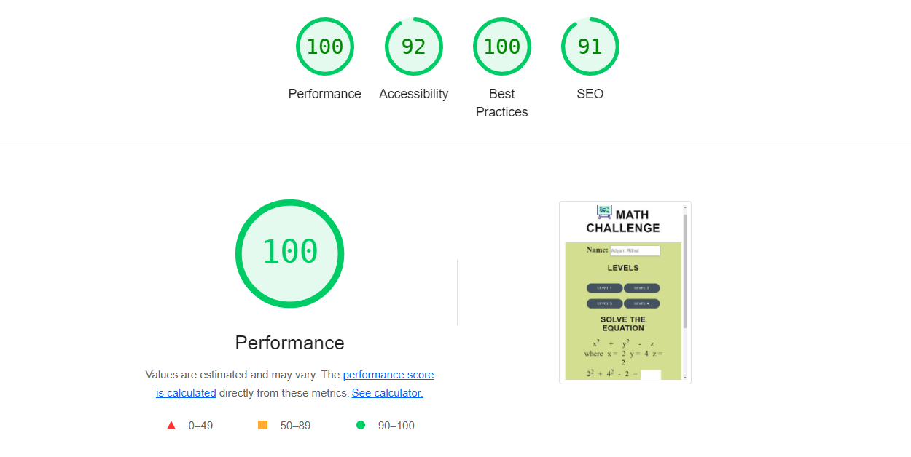
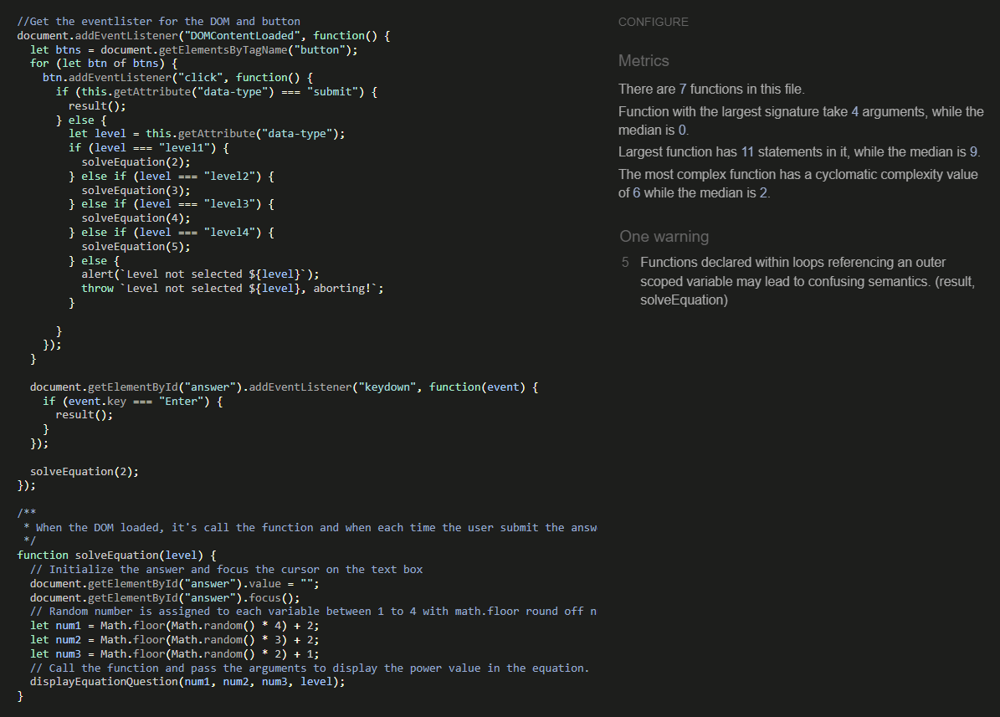

# Purpose
  The Math Challenge website is designed to assess users' equation-solving skills. As users progress, the difficulty of the equations increases by raising the power of the variables. With each level, the exponents for both x and y variables are incremented, making the problems more challenging.
.mcont

# Responsive 
Responsive screen image for the different device, used https://ui.dev/amiresponsive website to capture the image. 

## Project Goals
 The Math Challenge website aims to assess and enhance users' equation-solving skills through a structured progression of difficulty levels.
### User Goals
Improve and test their ability to solve mathematical equations.
Progress through increasingly challenging levels to build confidence and proficiency.
Track their progress and see how they measure up against higher levels of difficulty.
### Site Owner Goals
Engage users with a challenging and educational platform.
Encourage consistent use and progression through the levels.
Promote the website as a valuable tool for learning and improving math skills.
Gather user data to refine and enhance the learning experience.
## User Experience
### Target Audience
Students seeking to improve their math skills.
Teachers looking for supplemental tools to aid in math education.
Math enthusiasts interested in challenging themselves with complex problems.
Parents wanting to provide their children with additional math practice.
Educational institutions searching for engaging math resources.

# Features
## Screen content
The Home page shows thw equation and assignment to solve the eqaution..

# Performance
Tested the performance by using Google Lighthouse in Google Chrome Developer Tools.  

Home Page

# Validator Test
## HTML
 For an empty response in the answer text box, an alert message will be displayed, indicating "NaN" and the correct answer.
 No error were returned when passing through website: https://validator.w3.org/#validate_by_input
 

Home

## CSS
No error were returned when passing through website: https://jigsaw.w3.org/css-validator/#validate_by_input

CSS style

  

## Javascript
No error and one warning were returned when passing through website: https://jshint.com/

Java script

  

# Browser compatability

Tested on the following browsers:  
Google Chrome  
Microsoft Egde 

# Bugs

| **Bug** | **Fix** |
| ----------- | ----------- |
| Level 3 and Level 4 power was same | Beacuse same id  was assigned, changed the id |
| The light house accessibility is less than 90, because of the not following the sematic order of the heading | Used the heading in the  sematic order |

# Deployment

The main branch of this repository contains the most up-to-date version and has been utilized for the deployed version of the site. This project was created using the Code Institute student template.

Code Institute Template for CodeAnywhere

  - Click Use This Template button.
  - Give your repository a name, and description.
  - Open CodeAnywhere EDI and log into your account.
  - Click New Workspace button.
  - Create a workspace from your project repository by creating a clone.

Deployment
  - Click the setting.
  - Click the pages under the code and automation.
  - Select the branch main and save. 

Creating a clone

  - From the repository, click Code.
  - In the Clone >> HTTPS section, copy the clone URL for the repository.
  - Paste a link into the designated area on the CodeAnywhere.

Forking

  - From the repository, click Fork.
  - Give your repository a name.
  - Click Create fork.

# Technologies
  - HTML 
  - CSS 
  - JavaScript 

# Credits

## Content

 The structure and page format of the website is inspired from the Love Maths.

## Media

All the image are used from the website : https://www.pexels.com/  
All the icon are used from the website: https://fontawesome.com/  
Responsive screen is capture from the website: https://ui.dev/amiresponsive

## Fonts

 Some the font are imported from the website :https://fonts.google.com/

## Acknowledgements

I would like to thank, Harry(Mentor) for support for my project in reviewing and providing some guides.